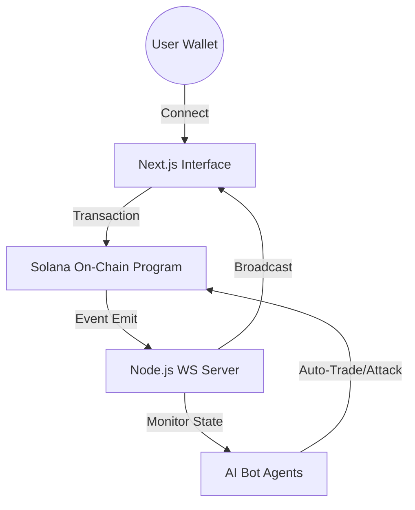

# <p align="center">🌀 SOLMAP</p>
<p align="center">
  <b>A living blockchain reality where every transaction ripples through the world.</b><br>
  <i>Built for the Solana Renaissance Hackathon 2026</i>
</p>

<p align="center">
  
  
  
  
</p>

---

## 📽️ The Vision
**SOLMAP** is not just a game; it's a decentralized world simulation. It leverages Solana's sub-second finality to create a real-time strategy map where the global state is entirely on-chain. Factions don't just "play"—they evolve based on a deterministic **Chaos Engine** and autonomous **AI Bot Agents**.

> [!IMPORTANT]
> **Every SOL traded** increases the global Chaos Level. High chaos triggers automated wars, betrayals, and power shifts. The world never sleeps.

---

## 🕹️ Core Mechanics

| Action | Impact | Reality Shift |
| :--- | :--- | :--- |
| **Connect** | Identity | Anchor PDA initialization for your faction alignment |
| **Trade** | Power | Converts SOL into faction power (burn/transfer) |
| **Attack** | Territory | Hexagonal zone capture via power-vs-defense math |
| **Chaos** | Events | Probability rolls trigger War, Betrayals, or Airdrops |

---

## 🏗️ Technical Architecture



### 🛠️ The Stack
*   **On-Chain:** Anchor / Rust (PDA-based state management, custom instruction set)
*   **Real-time Engine:** Node.js + WebSockets (Sub-400ms event propagation)
*   **Brain:** Gemini-powered AI Agents simulating faction behavior
*   **Visuals:** Next.js + Framer Motion + Glassmorphism UI

---

## 🌪️ The Chaos Engine
The heart of SOLMAP is a deterministic probability engine.

*   **WAR (Chaos > 80):** The strongest faction is forced into an automated attack against the weakest.
*   **BETRAYAL (Chaos > 50):** Internal sabotage cripples faction power — trust is a luxury.
*   **AIRDROP (Deterministic Roll):** Random power surges reward factions that hold their ground.

---

## ⚡ Quick Start

### 🌐 Frontend (Visual Hub)
```bash
cd frontend && npm install && npm run dev
```

### 🤖 Backend (AI & Events)
```bash
cd backend && npm install && npm run dev
```

### ⚓ On-Chain (Smart Contracts)
```bash
cd programs
anchor build
anchor deploy --provider.cluster devnet
```

---

## 🎨 Design Aesthetic
SOLMAP uses a **Hacker-Cyberpunk** aesthetic:
- **Glassmorphism** panels for real-time data feeds
- **Animated Hex Map** representing territory control
- **Dynamic Chaos Bar** that shakes the screen as instability rises
- **Mono-typography** (JetBrains Mono) for a terminal-grade experience

---

<p align="center">
  Built with 💜 for the Solana Ecosystem.<br>
  <b>SOLMAP © 2026</b>
</p>
